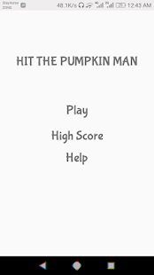
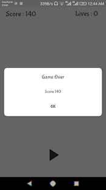

# Hit the Pumpkin Man
Whack a mole like Game developed using Kotlin


## Screenshots




# Description
```
Who has never played or seen playing Whack-A-Mole in the playroom, the game where you had to smash the heads of moles constantly coming out of their holes? Probably very few.

Well, this is renewed version of the classic Whack-A-Mole game, where Pumpkin Man lurk quickly, but you have to be faster than them! Try your hand at this game from the old flavor: hit the Pumpkin Man with a hammer, be quick and ready. Always try to hit them when they are out completely: you will earn more points. Do not be fooled by their sweet little face: they are spiteful!

Going forward the Pumpkin Man will become faster, making the game increasingly difficult.


Test your eye to hand (or fingers!) coordination and have fun while you’re at it. Just download it and TRY not to get hooked.
```


# License
```
MIT License

Copyright (c) 2020 Umair Ayub

Permission is hereby granted, free of charge, to any person obtaining a copy
of this software and associated documentation files (the "Software"), to deal
in the Software without restriction, including without limitation the rights
to use, copy, modify, merge, publish, distribute, sublicense, and/or sell
copies of the Software, and to permit persons to whom the Software is
furnished to do so, subject to the following conditions:

The above copyright notice and this permission notice shall be included in all
copies or substantial portions of the Software.

THE SOFTWARE IS PROVIDED "AS IS", WITHOUT WARRANTY OF ANY KIND, EXPRESS OR
IMPLIED, INCLUDING BUT NOT LIMITED TO THE WARRANTIES OF MERCHANTABILITY,
FITNESS FOR A PARTICULAR PURPOSE AND NONINFRINGEMENT. IN NO EVENT SHALL THE
AUTHORS OR COPYRIGHT HOLDERS BE LIABLE FOR ANY CLAIM, DAMAGES OR OTHER
LIABILITY, WHETHER IN AN ACTION OF CONTRACT, TORT OR OTHERWISE, ARISING FROM,
OUT OF OR IN CONNECTION WITH THE SOFTWARE OR THE USE OR OTHER DEALINGS IN THE
SOFTWARE.
```
